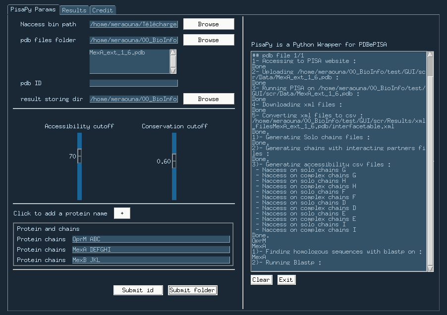
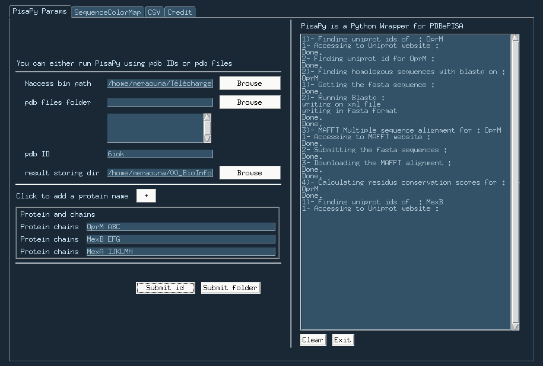
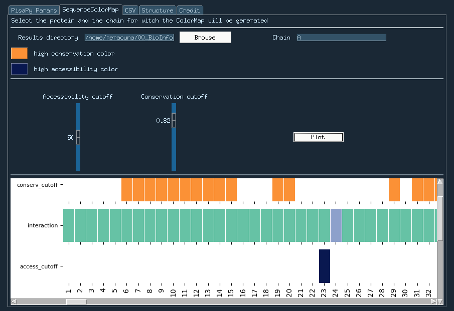
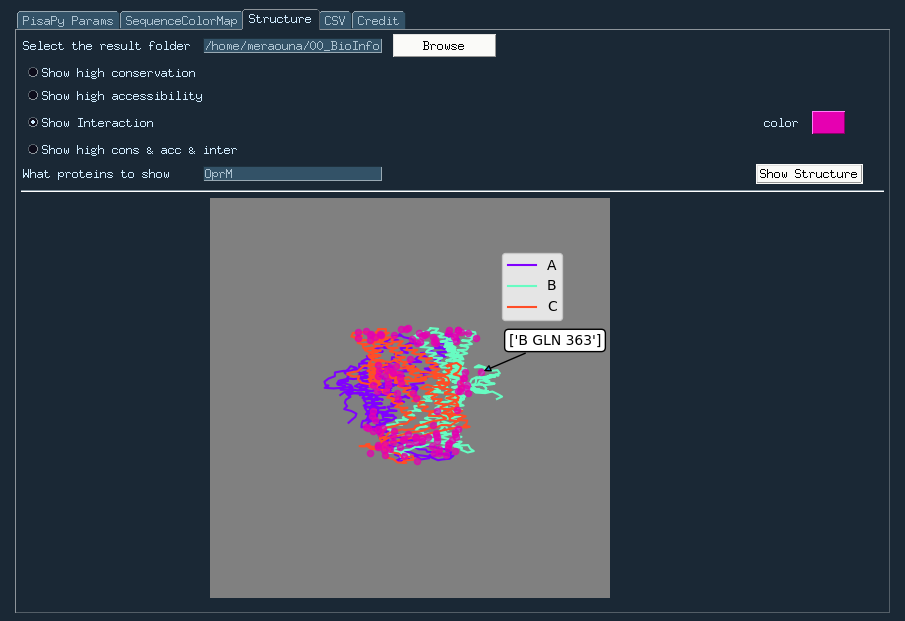
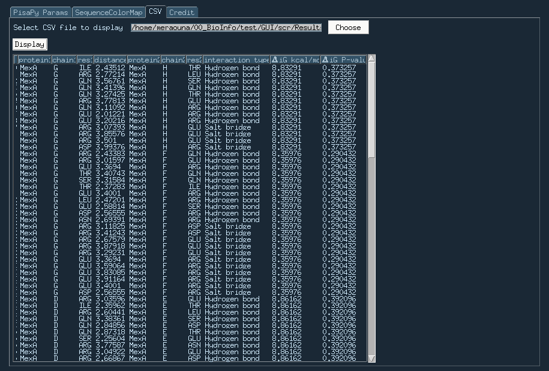

# PisaPyUI
## Description :
User Interface for [PisaPy](https://github.com/hocinebib/PisaPy)
a Python PDBePISA Wrapper to automatically interact with PDBePISA (Proteins, Interfaces, Structures and Assemblies) web server.
It also gives the residues accessibility (using [Naccess](http://www.bioinf.manchester.ac.uk/naccess/nacwelcome.html)) and conservation (using [Blastp](https://blast.ncbi.nlm.nih.gov/Blast.cgi?PAGE=Proteins), [MAFFT](https://mafft.cbrc.jp/alignment/server/) and [JS Divergence](https://compbio.cs.princeton.edu/conservation/score.html) with [ResConsScorePipeline](https://github.com/hocinebib/ResConsScorePipeline))

---

## Requirements :

### System :
* Linux : 
The code has only been tested on Ubuntu.

### Browser :
The code has only been tested with firefox.

### Python packages :
In order to be able to run this code of course you need to have python3 but also some python packages :
* [`selenium`](https://selenium-python.readthedocs.io/)
* [`argparse`](https://docs.python.org/3/library/argparse.html)
* [`BioPython`](https://biopython.org/)
* [`pandas`](https://pandas.pydata.org/)
* [`matplotlib`](https://matplotlib.org/)
* [`halo`](https://github.com/manrajgrover/halo)
* [`Biopython`](https://biopython.org/)
* [`PySimpleGUI`](https://pysimplegui.readthedocs.io/en/latest/)

PyPi installation :
```shell
$pip install selenium
$pip install halo
$pip install argparse
$pip install pandas
$pip install networkx
$pip install matplotlib
$pip install biopython
$pip install tk
$pip install PySimpleGUI
```

Conda installation :
```bash
$conda create -n pisapy python
$source activate pisapy
$conda install -c conda-forge selenium
$conda install -c conda-forge halo
$conda install -c conda-forge argparse
$conda install pandas
$conda install -c anaconda networkx
$conda install -c conda-forge matplotlib
$conda install -c conda-forge biopython
$conda install -c anaconda tk
$conda install -c conda-forge pysimplegui
```

### Others :
selenium requires [geckodriver](https://github.com/mozilla/geckodriver/releases) for firefox, check this [link](https://selenium-python.readthedocs.io/installation.html#drivers) for the other browsers.
[Naccess](http://www.bioinf.manchester.ac.uk/naccess/nacwelcome.html) is also needed.

---

## The interface looks like this :
* Parameters and running section :
pdb files :

pdb id :


* Sequence Color Map :


* Structure Visualization :


* Table display :

