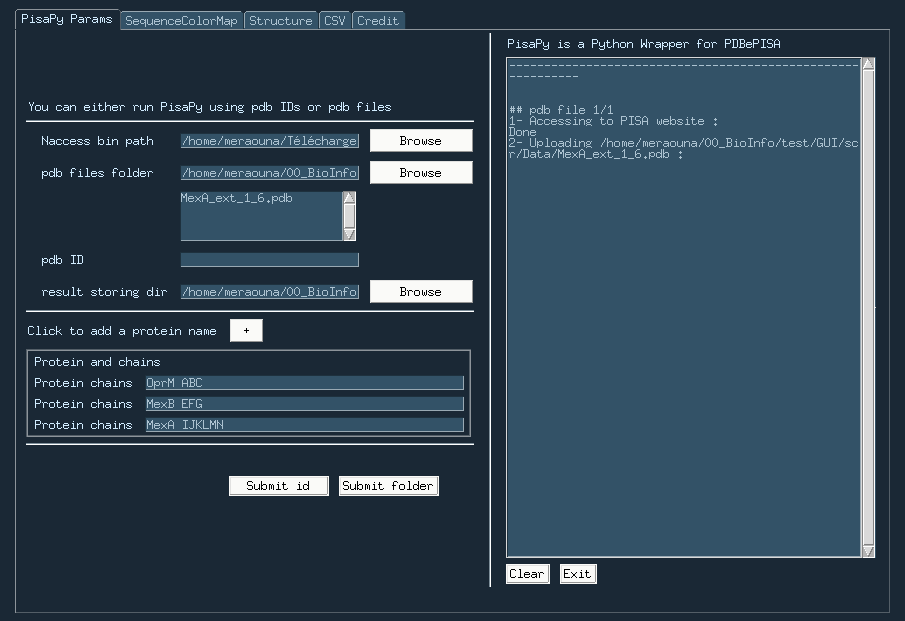

# PisaPyUI
User Interface for [PisaPy](https://github.com/hocinebib/PisaPy)

---

This is a first try at GUI

---

The interface looks like this :
* Parameters and running section :
pdb files :

pdb id :

* Sequence Color Map :

* Structure Visualization :

* Table display :
